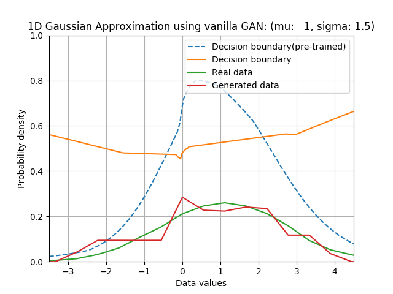
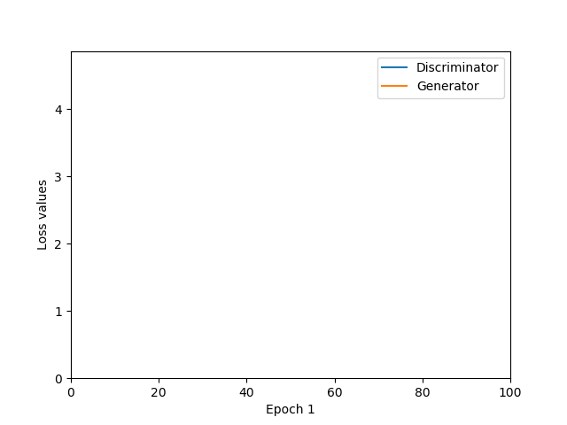

# vanilla_GAN
PyTorch implementation of Vanilla GAN

## 1D Gaussian pdf approximation
### Results
* For mu = 0.0, sigma = 1.0:

* For mu = 1.0, sigma = 1.5:

### References
1. http://blog.aylien.com/introduction-generative-adversarial-networks-code-tensorflow/
2. http://blog.evjang.com/2016/06/generative-adversarial-nets-in.html
3. https://github.com/hwalsuklee/tensorflow-GAN-1d-gaussian-ex

## Generating MNIST dataset
### Network architecture
* Generator
    * hidden layers: Three fully-connected (256, 512, and 1024 nodes, respectively), Leaky ReLU activation
    * output layer: Fully-connected (784 nodes), Tanh activation

* Discriminator
    * hidden layers: Three fully-connected (1024, 512, and 256 nodes, respectively), Leaky ReLU activation
    * output layer: Fully-connected (1 node), Sigmoid activation
    * Dropout: dropout probability = 0.3

### Results
* For learning rate = 0.0002 (Adam optimizer), batch size = 128, # of epochs = 100:
<table align='center'>
<tr align='center'>
<td> GAN losses</td>
<td> Generated images</td>
</tr>
<tr>
<td>
<td>
</tr>
</table>

### References
1. https://github.com/znxlwm/pytorch-MNIST-CelebA-GAN-DCGAN
2. https://github.com/moono/moo-dl-practice/tree/master/Work-place/GAN-MNIST
3. https://github.com/yunjey/pytorch-tutorial/blob/master/tutorials/02-intermediate/generative_adversarial_network

