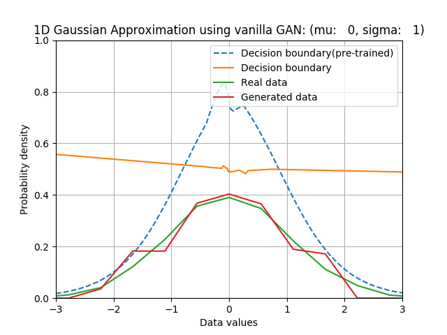

# vanilla_GAN
PyTorch implementation of Vanilla GAN

## 1D Gaussian pdf approximation
### Results
* For mu = 0.0, sigma = 1.0:

* For mu = 1.0, sigma = 1.5:

### References
1. http://blog.aylien.com/introduction-generative-adversarial-networks-code-tensorflow/
2. http://blog.evjang.com/2016/06/generative-adversarial-nets-in.html
3. https://github.com/hwalsuklee/tensorflow-GAN-1d-gaussian-ex

